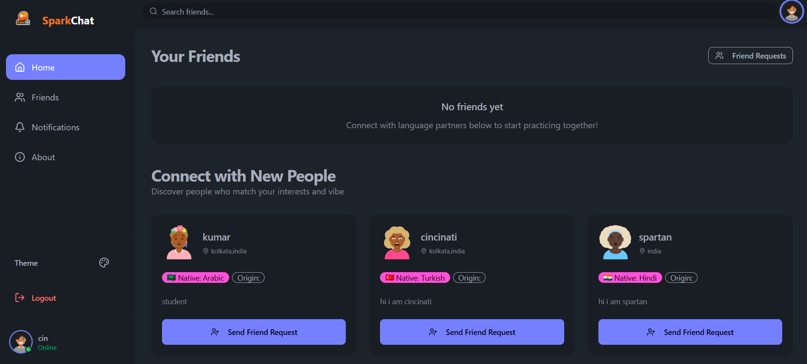
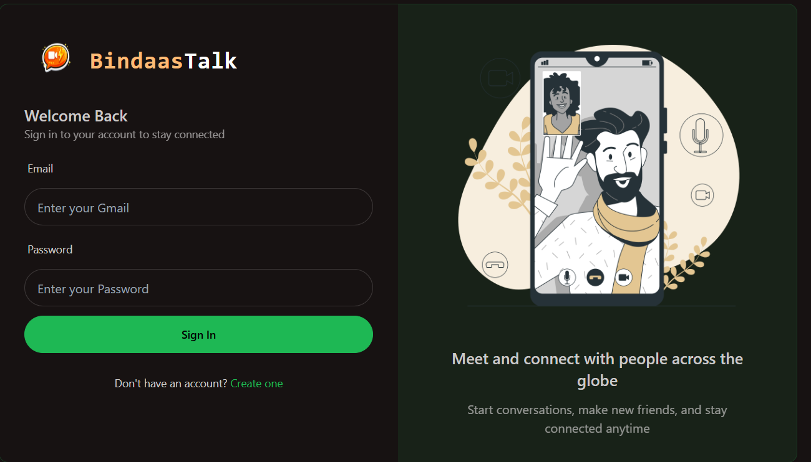
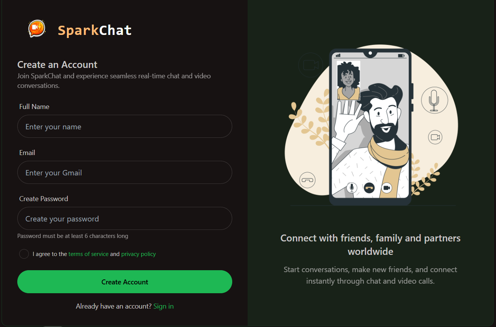
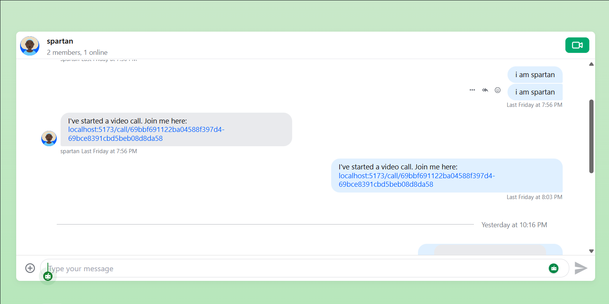
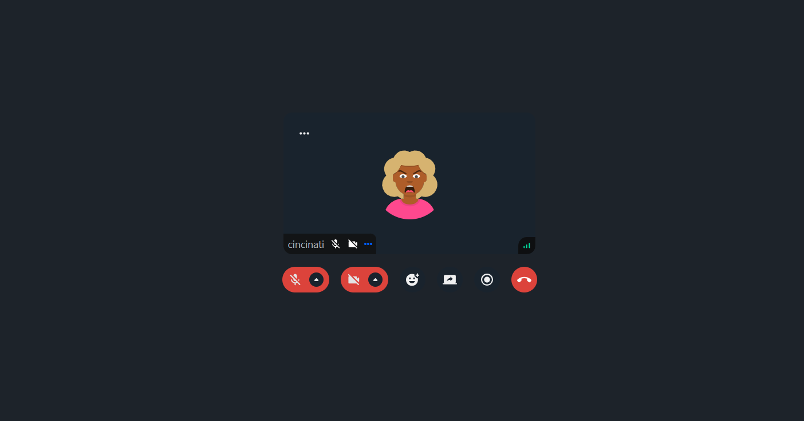
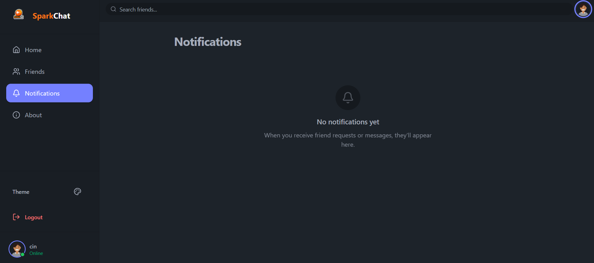

# 🎙️ BindaasTalk – Real-Time Video Chat & Social Connection App

BindaasTalk is a modern **MERN-stack video chat and social networking app** designed for people who want to connect, communicate, and build real conversations.  
It allows users to discover new people, send friend requests, chat in real-time, and make HD video calls — all in one beautifully designed platform.

---

## 📌 About the App

Users can:

- ✅ Register & login securely with **JWT Authentication**
- ✅ Discover new people and **Send Friend Requests**
- ✅ Accept / reject incoming friend requests
- ✅ Chat with friends in **Real-Time** using Stream Chat SDK
- ✅ Make **HD Video & Audio Calls** powered by Stream Video SDK
- ✅ Receive **Notifications** for friend requests
- ✅ Switch between **Multiple Themes** (DaisyUI)
- ✅ Fully **Responsive UI** for mobile and desktop

✨ The platform provides a **clean modern UI**, smooth animations, and a fully responsive layout.

---

## 🖼️ Screenshots

### 🏠 Home Page

### 🔐 Login & Signup

### 💬 Chat

### 📹 Video Calling

### 🔔 Notifications

---

## 🛠️ Technologies Used

### Frontend (Client)
- React.js 19
- Vite
- Tailwind CSS
- DaisyUI
- React Router v7
- Axios
- TanStack React Query (@tanstack/react-query)
- Zustand (State Management)
- React Hot Toast
- Lucide React Icons
- Stream Video React SDK
- Stream Chat React SDK

### Backend (Server)
- Node.js
- Express.js
- MongoDB (Mongoose ORM)
- JWT Authentication
- bcryptjs (Password Hashing)
- CORS
- dotenv (Environment Variables)
- Socket.io (Real-Time Events)

---

## 🌐 APIs & SDKs Used

### 🔵 Stream Video SDK
Used for:
- HD Video & Audio Calling
- Real-time call management
- Camera & microphone controls

### 🟢 Stream Chat SDK
Used for:
- Real-time messaging
- Message history
- Online presence / typing indicators

---

## ⭐ Key Features

### 🔐 User Authentication
- Secure login & registration
- Password hashing using bcrypt
- JWT token-based authentication
- Protected routes (Frontend + Backend)

### 👥 Friend System
- Send & receive friend requests
- Accept or reject requests
- View all connected friends
- Discover new people to connect with

### 💬 Real-Time Chat
- Instant messaging powered by Stream Chat SDK
- Message history persistence
- Online/offline status indicators
- Typing indicators

### 📹 Video & Audio Calling
- HD video calls using Stream Video SDK
- Audio-only call support
- Camera & mic toggle controls
- Clean in-call UI

### 🔔 Notifications
- Friend request notifications
- Real-time notification updates

### 🎨 UI & UX
- Fully responsive design (mobile + desktop)
- Hamburger menu for mobile navigation
- Multiple theme support via DaisyUI
- Toast notifications for success/error
- Smooth transitions and animations
- Clean sidebar navigation

---

## 🚀 Project Summary

**BindaasTalk** is a complete **MERN-stack application** that combines real-time video calling, instant messaging, and a social friend system.  
It allows users to **discover, connect, chat, and video call** securely in a single, beautifully designed platform.

---

## 📌 Future Improvements
- Screen sharing during calls
- Group video calls
- User profile customization
- Message read receipts
- Deployment with Docker / Cloud

---

## 👨‍💻 Author
**Pawan Kumar**
